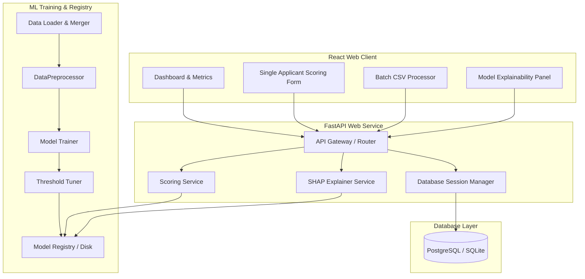

# RiskLens: AI-Powered Credit Risk Assessment & Scoring Platform

RiskLens is a premium, end-to-end credit risk intelligence platform designed to assess, score, and analyze applicant defaults using machine learning. It features a state-of-the-art XGBoost model, real-time SHAP explainability visualizations, a React-based governance dashboard, and a fully automated model training and evaluation pipeline.

The design, data schema standardization, and model parameters are developed in alignment with modern credit risk research, specifically the thesis **"Utilizing AI for Improved Credit Risk Assessment" (Baglarbasi, 2025)**.

---

## 1. System Architecture

RiskLens operates on a multi-tier microservices architecture. It combines a containerized React client interface, a high-performance FastAPI web server, a database layer (PostgreSQL or SQLite), and an offline machine learning model training environment.



---

## 2. Core Features

*   **Real-time Scoring**: Evaluates single credit applications instantly using the production XGBoost classifier, mapping profiles to Low, Medium, and High-risk rating bands.
*   **SHAP Explainability**: Visualizes decision drivers using local cooperative game theory. Provides force plots and waterfall graphs directly to underwriters, eliminating "black-box" model compliance concerns.
*   **Batch CSV Processing**: Uploads and processes thousands of applicant profiles simultaneously, returning interactive risk tables and downloadable results.
*   **Model Telemetry & Dashboard**: Tracks production performance metrics, default probabilities, population stability indexes (PSI), and feature drift in real-time.
*   **Compliance & Governance**: Implements automated audit trails for model outputs, capturing feature hashes, timestamps, preprocessor versions, and validation results.
*   **Self-Healing Drift Rebuilder**: Alerts administrators to feature drift and permits XGBoost model retraining using fresh quarterly data through a secure UI panel.

---

## 3. Technology Stack

### Frontend (React Application)
*   **Framework**: React 18 (Vite-powered SPA)
*   **Styling**: Vanilla CSS + Tailwind CSS (Custom Neomorphic & Dark Mode)
*   **Routing**: React Router v6
*   **Charts**: Recharts (for telemetry, line charts, and metric gauges)
*   **Icons**: Lucide React
*   **HTTP Client**: Axios

### Backend (Python FastAPI)
*   **Framework**: FastAPI (ASGI server powered by Uvicorn)
*   **ORM / DB Client**: SQLAlchemy + Alembic
*   **Data Validation**: Pydantic v2
*   **Database**: SQLite (for development) and PostgreSQL (for production)
*   **Async Services**: `asyncio`, `aiofiles`, `aiohttp`

### Machine Learning & Explainability
*   **Algorithms**: XGBoost, LightGBM, Random Forest, Logistic Regression
*   **Data Wrangling**: Pandas, NumPy, Scikit-learn, SciPy
*   **Interpretability**: SHAP (TreeExplainer and KernelExplainer)
*   **Serialization**: Joblib

---

## 4. Project Structure

```
credit_risk_project/
├── backend/                       # FastAPI Backend Application
│   ├── app/
│   │   ├── api/                   # Router and Endpoint Handlers (v1)
│   │   ├── core/                  # Security, Logging, and Exception handlers
│   │   ├── database/              # DB Session Configuration
│   │   ├── models/                # SQLAlchemy Entities & Pydantic Schemas
│   │   ├── services/              # Scorer, Preprocessor, and SHAP Explainer
│   │   ├── utils/                 # Metrics & Helpers
│   │   └── main.py                # FastAPI Application Entrypoint
│   ├── ml_models/                 # Cached Model Artifacts (.pkl, .json)
│   └── tests/                     # Unit & Integration Pytest Suite
├── frontend/                      # React Frontend Application
│   ├── public/                    # Assets & Static Icons
│   ├── src/
│   │   ├── components/            # Reusable UI & Layout Components
│   │   ├── context/               # AuthContext & State Managers
│   │   ├── hooks/                 # Custom React Hooks (useApi, useAuth)
│   │   ├── pages/                 # Routing Pages (Dashboard, Scoring, Performance)
│   │   ├── services/              # API and Storage Services
│   │   └── index.css              # Global Styling Sheet
├── ml_training/                   # Offline ML Training Pipeline
│   ├── data/                      # Training & Processed CSV Datasets
│   ├── scripts/                   # Merging, preprocessing, and training scripts
│   ├── ml_models/                 # Model pickles generated during training
│   └── MODEL_TRAINING.md          # Exhaustive training documentation & parameters
└── docker-compose.yml             # Orchestration for PostgreSQL, Backend, & Frontend
```

---

## 5. Getting Started & Installation

### Option A: Quickstart with Docker Compose (Recommended)
Orchestrate the entire platform (PostgreSQL, FastAPI Backend, React Frontend, and Adminer Database GUI) using Docker Compose:

1.  **Clone the Repository** and navigate to the project directory:
    ```bash
    cd credit_risk_project
    ```
2.  **Spin up the containers**:
    ```bash
    docker-compose up --build
    ```
3.  **Access the applications**:
    *   **Frontend Interface**: `http://localhost:3000`
    *   **Backend Swagger API Docs**: `http://localhost:8000/docs`
    *   **Adminer DB Console**: `http://localhost:8080` (Server: `postgres`, Username: `postgres`, Password: `postgres`, DB: `credit_risk`)

---

### Option B: Local Manual Installation

#### 1. Backend Setup
1.  Navigate to the `backend` directory:
    ```bash
    cd backend
    ```
2.  Create and activate a virtual environment:
    ```bash
    python -m venv .venv
    # Windows:
    .venv\Scripts\activate
    # macOS/Linux:
    source .venv/bin/activate
    ```
3.  Install the required dependencies:
    ```bash
    pip install -r requirements.txt
    ```
4.  Configure environment variables by copying `.env.example`:
    ```bash
    cp .env.example .env
    ```
    *Specify your `DATABASE_URL` (defaults to sqlite `./test.db`), `SECRET_KEY`, and `PRIMARY_MODEL`.*
5.  Launch the FastAPI server:
    ```bash
    uvicorn app.main:app --reload --port 8000
    ```

#### 2. Frontend Setup
1.  Navigate to the `frontend` directory:
    ```bash
    cd frontend
    ```
2.  Install packages:
    ```bash
    npm install
    ```
3.  Configure environment variables by copying `.env.example`:
    ```bash
    cp .env.example .env
    ```
    *Ensure `VITE_API_BASE_URL` is set to point to your backend: `http://localhost:8000`*
4.  Start the Vite development server:
    ```bash
    npm run dev
    ```
    *The app will launch at `http://localhost:3000`.*

---

## 6. Machine Learning Pipeline Details

The training pipeline integrates and maps data from three major open-source repositories: **Kaggle Home Credit Default Risk**, **Kaggle Give Me Some Credit**, and the **UCI German Credit Dataset**.

### Preprocessing & Feature Engineering
Raw data undergoes a structured pipeline inside `DataPreprocessor`:
1.  **Imputation**: Missing values are imputed using medians to prevent target leakage.
2.  **Outlier Clipping**: Extreme observations outside $3.0 \times IQR$ are trimmed.
3.  **Feature Encoding**: Ordinal mapping for risk behavior (`payment_history`, `education_level`), binary encoding for gender/employment, and One-Hot Encoding (with first-category drop) for multi-class fields.
4.  **Scaling**: Continuous inputs are normalized using `StandardScaler`.
5.  **SMOTE**: Applied exclusively on cross-validation folds to resolve minority class imbalance without leaking target metrics.

### Derived Features (Engineered)
*   **Loan-to-Income (LTI)**: $\text{loan\_amount} / (\text{income} + 1.0)$
*   **Assets-to-Loan**: $\text{assets\_value} / (\text{loan\_amount} + 1.0)$
*   **Debt-to-Assets**: $(\text{debt\_to\_income\_ratio} \times \text{income}) / (\text{assets\_value} + 1.0)$
*   **Employment Stability**: $\text{years\_at\_current\_job} / \max(1.0, \text{age} - 17.0)$
*   **FICO-Age Interaction**: $\text{credit\_score} \times \text{age}$
*   **Solvency Indicators**: Binary triggers for subprime scores ($<620$), defaults ($>0$), and high DTI ($>40\%$).

### Model Evaluation Matrix
Under a recall-constrained optimization ($\text{Recall} \ge 75\%$), models yielded the following validation performance:

| Model Name | Optimal Threshold | Accuracy | Precision | Recall | F1-Score | AUC-ROC |
| :--- | :---: | :---: | :---: | :---: | :---: | :---: |
| **XGBoost** | **0.1075** | **87.71%** | **35.67%** | **75.01%** | **48.35%** | **89.52%** |
| **LightGBM** | 0.1119 | 86.39% | 32.97% | 75.01% | 45.81% | 88.85% |
| **Random Forest** | 0.4702 | 86.80% | 33.77% | 75.01% | 46.57% | 88.77% |
| **Logistic Regression** | 0.5722 | 85.78% | 31.86% | 75.01% | 44.73% | 87.97% |
| **Decision Tree** | 0.5934 | 84.57% | 29.90% | 75.26% | 42.80% | 86.29% |

*For complete training procedures and hyperparameter grids, consult [MODEL_TRAINING.md](file:///c:/All%20Projects/credit_risk_project/ml_training/MODEL_TRAINING.md).*

---

## 7. Testing & Quality Checks

### Backend Test Suite
The backend contains automated unit and integration tests using `pytest` and `pytest-asyncio` covering data preprocessing, model loaders, scorer calculations, and FastAPI routers.

Run the tests inside the `backend` folder:
```bash
pytest --cov=app tests/
```

### Frontend Code Quality
Validate code layout and run code quality formatting:
```bash
cd frontend
npm run lint
```

---

## 8. License

This project is proprietary and confidential. All rights reserved. For development access or commercial licensing inquiries, contact the platform governance team.
