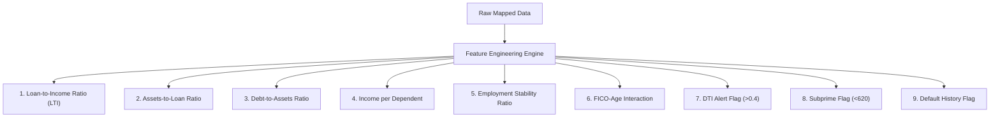

# Machine Learning Model Training & Performance Report

This report documents the end-to-end Machine Learning training pipeline, preprocessing techniques, engineered features, model architectures, and evaluation metrics for the Credit Risk Assessment Platform. The design and methodology are based on the thesis: **"Utilizing AI for Improved Credit Risk Assessment" (Baglarbasi, 2025)**.

---

## 1. Data Collection & Multi-Source Merging

To train a robust and generalized credit scoring system, the pipeline standardizes and integrates data from three major open-source credit datasets:

1. **Kaggle Home Credit Default Risk** (`application_train.csv`)
2. **Kaggle Give Me Some Credit** (`cs-training.csv`)
3. **UCI German Credit Dataset** (`german_credit_data.csv`)

### Schema Standardization & Mapping
Since these datasets have heterogeneous features and columns, the `DataLoader` standardizes them into a unified Credit Risk API schema. The mapped features are grouped into five distinct domains:

| Category | API Field Name | Source Mapping & Normalization Technique |
| :--- | :--- | :--- |
| **Demographics** | `age` | Derived from days since birth (`-DAYS_BIRTH / 365.25`) or parsed directly; bound between 18 and 100. |
| | `gender` | Unified to `Male`, `Female`, or `Non-binary`. |
| | `education_level` | Mapped to `High School`, `Bachelor`, `Master`, or `PhD`. |
| | `marital_status` | Standardized to `Single`, `Married`, `Divorced`, or `Widowed`. |
| **Financials** | `income` | Annualized total income (converted from monthly if necessary). |
| | `credit_score` | Calibrated into a standard FICO credit score range ($300 - 850$). Derived from external risk sources (e.g., `EXT_SOURCE_2`) or revolving utilization. |
| | `loan_amount` | Mapped credit limit or requested loan amount. |
| | `loan_purpose` | Randomly/logically assigned to `Personal`, `Auto`, `Home`, `Education`, or `Business`. |
| | `debt_to_income_ratio`| Annual debt payments divided by annual income, clipped to $[0.0, 1.0]$. |
| | `assets_value` | Estimated based on real estate and car ownership multipliers. |
| **Employment** | `employment_status` | Binary indicator (`Employed` / `Unemployed`) based on job duration. |
| | `years_at_current_job`| Number of years in the current role, derived from days employed. |
| **History** | `payment_history` | Standardized ordinal ranking of payment behavior: `Good`, `Fair`, or `Poor`. |
| | `previous_defaults` | Number of times 30+ or 90+ days past due. |
| | `number_of_dependents`| Count of children or other financial dependents. |
| **Target** | `default` | Binary label: `0` (Paid back, non-default), `1` (Delinquent/Defaulted). |

### Dataset Partitioning
The merged dataset is split using stratified partitioning to preserve the default class distribution:
* **Training Set**: 70% of the dataset
* **Validation Set**: 15% of the dataset
* **Test Set**: 15% of the dataset
* **Reproducibility**: Set with `random_state=42` to guarantee exact split outcomes across runs.

---

## 2. Preprocessing Pipeline (`DataPreprocessor`)

The preprocessing stage transforms raw, standardized data into numeric tensors suitable for machine learning training. It employs the following techniques sequentially:

### A. Missing Value Handling
* **Drop Strategy**: Rows containing critical missing fields are dropped to avoid training on artificial patterns.
* **Impute Strategy**: Non-critical numerical missing variables are filled using either the **mean** or **median** of the training distribution, preventing data leakage from the validation/test sets.

### B. Outlier Detection & Removal
* **IQR Method**: Outliers in continuous numerical variables are detected using the Interquartile Range (IQR).
* **Threshold**: Continuous observations falling outside the boundaries are removed:
  $$\text{Lower Bound} = Q1 - 3.0 \times IQR$$
  $$\text{Upper Bound} = Q3 + 3.0 \times IQR$$
  *The $3.0\times$ multiplier is used (instead of the standard $1.5\times$) to remove only extreme outliers while preserving valid high-net-worth applicant profiles.*

### C. Feature Encoding
To handle non-numeric categorical variables:
1. **Ordinal Encoding**: Used for columns with a natural order.
   * `payment_history`: `{"Poor": 0, "Fair": 1, "Good": 2}`
   * `education_level`: `{"High School": 0, "Bachelor": 1, "Master": 2, "PhD": 3}`
2. **Binary Encoding**: Used for two-class nominal variables.
   * `gender`: `{"Male": 1, "Female": 0}` (Unknowns default to 0)
   * `employment_status`: `{"Employed": 1, "Unemployed": 0}`
3. **Nominal One-Hot Encoding**: Used for multi-class variables without hierarchy (e.g., `marital_status`, `loan_purpose`).
   * Implemented using `sklearn.preprocessing.OneHotEncoder`.
   * **Collinearity Mitigation**: Set `drop='first'` to drop the reference dummy variable, avoiding the dummy variable trap.
   * **Unseen Categories**: Configured with `handle_unknown='ignore'` to handle novel categories during production inference.

### D. Feature Scaling
* **Z-score Normalization**: Applied to numerical features using `StandardScaler`:
  $$z = \frac{x - \mu}{\sigma}$$
  This scales numerical fields to have a mean ($\mu$) of 0 and a standard deviation ($\sigma$) of 1. It is essential for distance-based models (Logistic Regression, SVMs) and neural network convergence.
* **Alternative**: The pipeline supports MinMax normalization ($[0, 1]$ scaling) as a configurable parameter.

### E. Imbalanced Data Techniques
Credit default datasets are highly imbalanced, where defaults (`1`) typically represent less than 10% of observations. The pipeline employs:
* **SMOTE (Synthetic Minority Over-sampling Technique)**: Optionally applied to training folds to synthetically generate minority class samples along the line segments joining k-nearest neighbors.
  * *Critical Leakage Prevention*: SMOTE is executed *only* within cross-validation training folds (via `imblearn.pipeline.Pipeline`) and is never applied to validation or test data.
* **Class Weight Adjustments**:
  * Tree models use `scale_pos_weight` (ratio of negative to positive samples) to scale the loss gradient of the minority class.
  * Baselines use `class_weight="balanced"` to adjust weights inversely proportional to class frequencies.

---

## 3. Feature Engineering

Nine derived features are generated to capture complex risk indicators that single variables fail to isolate.



### Engineered Features & Rationale

1. **Loan-to-Income Ratio (LTI)**
   $$\text{LTI} = \frac{\text{loan\_amount}}{\text{income} + 1.0}$$
   *Rationale*: Measures leverage. High LTI ratios are strongly correlated with default because a greater share of salary goes toward servicing debt.

2. **Assets-to-Loan Ratio**
   $$\text{Assets-to-Loan} = \frac{\text{assets\_value}}{\text{loan\_amount} + 1.0}$$
   *Rationale*: Measures collateral coverage. High values represent strong backup security, decreasing net credit risk.

3. **Debt-to-Assets Ratio**
   $$\text{Debt-to-Assets} = \frac{\text{debt\_to\_income\_ratio} \times \text{income}}{\text{assets\_value} + 1.0}$$
   *Rationale*: Financial leverage index. Captures overall solvency by measuring total annualized debt obligations relative to asset reserves.

4. **Income per Dependent**
   $$\text{Income per Dependent} = \frac{\text{income}}{\text{number\_of\_dependents} + 1.0}$$
   *Rationale*: Captures household disposable income. Multiple dependents dilute cash flow availability, increasing risk for a given income bracket.

5. **Employment Stability**
   $$\text{Employment Stability} = \frac{\text{years\_at\_current\_job}}{\max(1.0, \text{age} - 17.0)}$$
   *Rationale*: Normalizes job tenure against adult lifespan. A 25-year-old with 3 years on the job is more stable than a 50-year-old with 3 years.

6. **Credit Score & Age Interaction**
   $$\text{FICO-Age Interaction} = \text{credit\_score} \times \text{age}$$
   *Rationale*: Captures credit history maturity. Older individuals with higher FICO scores represent the lowest risk profile.

7. **High-Risk DTI Indicator**
   $$\text{is\_high\_risk\_dti} = \mathbb{I}(\text{debt\_to\_income\_ratio} > 0.4)$$
   *Rationale*: A hard indicator. Debt-to-income ratios above 40% represent a standard industry threshold for high financial stress.

8. **Subprime Credit Indicator**
   $$\text{is\_subprime\_credit} = \mathbb{I}(\text{credit\_score} < 620)$$
   *Rationale*: Identifies subprime FICO brackets. Scores below 620 trigger special risk pricing and lower approval rates.

9. **Previous Defaults Indicator**
   $$\text{has\_previous\_defaults} = \mathbb{I}(\text{previous\_defaults} > 0)$$
   *Rationale*: Captures historical payment discipline. Past delinquencies are the single strongest predictor of future defaults.

---

## 4. Cross-Validation & Model Training

### Cross-Validation Strategy
To prevent overfitting and report realistic performance, the models are evaluated using **10-fold Stratified Cross-Validation**. Stratification ensures each fold has the same ratio of defaults as the complete dataset.

### Evaluated Model Architectures

#### 1. Logistic Regression (Baseline)
* **Optimization Solver**: `saga` (efficient for large-scale datasets, supports elasticnet penalty).
* **Regularization**: ElasticNet (L1 ratio of 0.5, combining Lasso and Ridge penalties).
* **Class Weight**: Class 1 (default) weighted at $12.0$ to compensate for minority imbalance.

#### 2. Decision Tree (Baseline)
* **Structure Constraints**: `max_depth=10`, `min_samples_split=20`, `min_samples_leaf=10` to avoid shallow overfitting.
* **Class Weight**: Balanced.

#### 3. Random Forest (Ensemble Baseline)
* **Parameters**: 100 estimators, max depth of 15, minimum samples split of 10.
* **Class Weight**: Balanced.

#### 4. XGBoost (Advanced Gradient Boosting)
* **Hyperparameters**: `n_estimators=200`, `max_depth=6`, `learning_rate=0.05`, `subsample=0.8`, `colsample_bytree=0.8`.
* **Regularization**: L1 ($\alpha = 0.1$), L2 ($\lambda = 1.0$).
* **Class Balance**: `scale_pos_weight` set to the negative-to-positive ratio or adjusted dynamically.
* **Tuning Grid**: Evaluated via grid search across max depths $[4, 5, 6, 7]$, learning rates $[0.01, 0.05, 0.1]$, and subsamples $[0.7, 0.8, 0.9]$.

#### 5. LightGBM (Gradient Boosting)
* **Hyperparameters**: `n_estimators=200`, `num_leaves=31`, `learning_rate=0.05`, `subsample=0.8`, `colsample_bytree=0.8`.
* **Class Balance**: `scale_pos_weight` set to 1.0 (with SMOTE or customized thresholds).

#### 6. Stacking Ensemble
* **Architecture**: Combines multiple diverse classifiers to form a meta-learner.
* **Base Models**: Logistic Regression, Random Forest, XGBoost.
* **Meta-Learner**: Logistic Regression (with balanced class weights).
* **Fitting Protocol**: The base estimators generate out-of-fold probability predictions via 3-fold internal cross-validation. The meta-learner is then trained on these out-of-fold predictions, preventing target leakage.

---

## 5. Decision Threshold Optimization & Calibration

### The Recall-Constrained Problem
In credit risk, classifying defaults with a standard threshold of $0.5$ is highly sub-optimal. The cost of a **False Negative** (approving a borrower who defaults) is orders of magnitude higher than the cost of a **False Positive** (rejecting a borrower who would have paid back).

Thus, the pipeline implements threshold tuning to prioritize recall (identifying defaults) while keeping precision at an acceptable level.

### Calibration & Tuning Technique
1. **Precision-Recall Curve Analysis**: Traverses prediction probabilities on the validation set.
2. **Constrained Optimization**: Finds the threshold that meets the target minimum recall (configured at **75%**) while maximizing precision and F1-score:
   $$\max_{t} F_1(t) \quad \text{subject to} \quad \text{Recall}(t) \ge 0.75$$
3. **Threshold Calibration**: The fitted `ThresholdTuner` adjusts raw output probabilities to ensure alignment with true validation frequencies.

### Risk Rating Buckets
During inference, calibrated probabilities are categorized into three risk bands:
* **Low Risk**: Calibrated probability $< 25\%$ (eligible for automated approval)
* **Medium Risk**: Calibrated probability between $25\%$ and $65\%$ (referred for manual underwriter review)
* **High Risk**: Calibrated probability $\ge 65\%$ (declined automatically)

---

## 6. Explainability & Interpretability (SHAP)

To comply with financial regulations (e.g., Fair Credit Reporting Act, GDPR), the platform does not treat models as black boxes. It integrates **SHAP (SHapley Additive exPlanations)** values based on cooperative game theory.

```
Base Value (E[f(X)]) --> [ + Age Impact ] --> [ + FICO Impact ] --> [ - Income Impact ] --> Prediction
```

### SHAP Explainer Implementation
* **TreeExplainer**: Utilized for tree-based models (XGBoost, LightGBM, Random Forest) because it computes exact Shapley values in polynomial time rather than exponential time.
* **KernelExplainer**: Utilized as a fallback for non-tree models (Logistic Regression, Stacking Meta-Learner). A background dataset of 50 samples is drawn to construct the reference distribution, speeding up prediction approximation.

### Explainability Artifacts Generated
1. **Global Feature Importance**: Plots summarizing feature impact magnitude and direction across the validation sample.
2. **Local Decision Waterfall Plots**: For individual evaluations, these plots show how each feature moves the probability from the dataset's base rate ($E[f(x)]$) to the applicant's specific score.
3. **Force Plots**: Visual representations showing the "push-and-pull" of risk factors for a single prediction.

---

## 7. Model Performance Summary

The performance of the models evaluated on the validation set, using recall-optimized decision thresholds (aiming for $\ge 75\%$ recall), is summarized below:

### Comparative Performance Matrix

| Model Name | Optimal Threshold | Accuracy | Precision | Recall | F1-Score | AUC-ROC |
| :--- | :---: | :---: | :---: | :---: | :---: | :---: |
| **XGBoost** | **0.1075** | **87.71%** | **35.67%** | **75.01%** | **48.35%** | **89.52%** |
| **LightGBM** | 0.1119 | 86.39% | 32.97% | 75.01% | 45.81% | 88.85% |
| **Random Forest** | 0.4702 | 86.80% | 33.77% | 75.01% | 46.57% | 88.77% |
| **Logistic Regression** | 0.5722 | 85.78% | 31.86% | 75.01% | 44.73% | 87.97% |
| **Decision Tree** | 0.5934 | 84.57% | 29.90% | 75.26% | 42.80% | 86.29% |

### Key Findings & Analysis

1. **XGBoost Performance**:
   * XGBoost achieved the highest **AUC-ROC of 89.52%** and **F1-Score of 48.35%**.
   * By lowering the decision threshold to **0.1075**, XGBoost meets the target recall of **75.01%** while maintaining the highest precision (**35.67%**) among all candidates, meaning it flags defaults with the fewest false alarms (unnecessary credit rejections).

2. **Threshold Adjustments**:
   * For the tree-based models (XGBoost and LightGBM), the optimal threshold is low (~0.11). This is because gradient boosting models produce highly concentrated probabilities near 0 for the majority class, requiring a lower threshold to catch defaults.
   * For Logistic Regression, the threshold is higher (**0.5722**) because class-weight balancing shifts the raw probabilities upward.

3. **Baseline Comparison**:
   * The tree ensembles (XGBoost, LightGBM, Random Forest) outperform the Logistic Regression baseline by $1\% - 2\%$ in AUC-ROC. This indicates significant non-linear interactions and thresholds in features (such as the relationship between credit score, debt-to-income, and age) that linear models cannot fully capture.
   * Decision Tree performed the worst (AUC-ROC of 86.29%), showing that single estimators suffer from high variance and are less suited for credit risk than gradient boosting ensembles.
